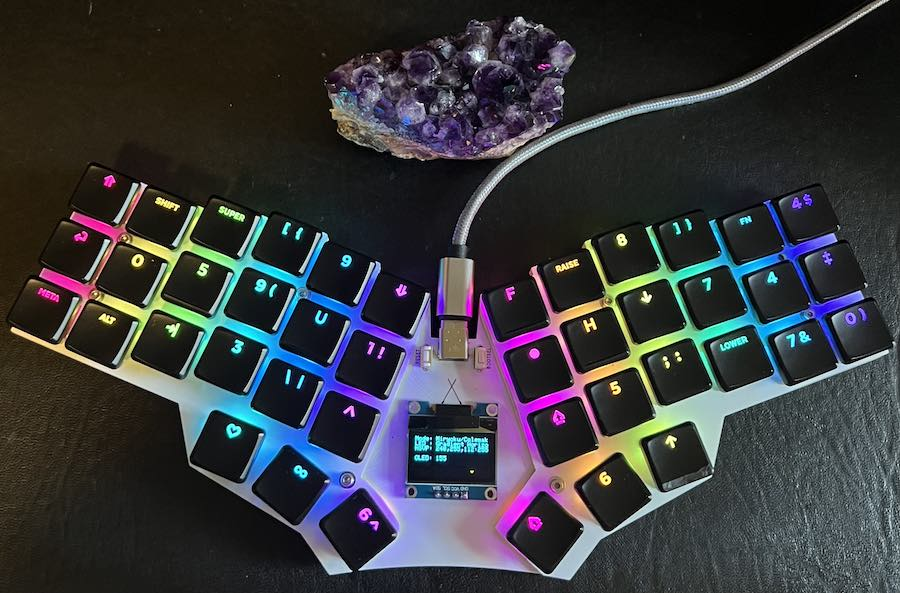

# richkbd 2.0
 
The richkbd keyboard is a 42 key single piece Kaihl Choc Hotswap based keyboard which uses the [RP2040](https://www.raspberrypi.com/products/rp2040/) microcontroller. The layout of the keys is identical to two [Corne keyboards](https://github.com/foostan/crkbd) joined together into one. The halves are placed 21° from horizontal and the top keys are separated by 35mm.

If you wanted to construct your own, take a look at the [Build Guide](doc/buildguide.md).

## Features

- Powered by the [RP2040 Stamp](https://www.solder.party/docs/rp2040-stamp) helper board
- USB-C Card edge connector
- Neopixel LED per key
- OLED Display
- Buttons to reset and enter bootloader mode
- Fairly thin with a bottom plate, PCB board layer, and a top layer to hold the sockets
 
## Software

There is a full QMK software implementation which you ca find [here](https://github.com/rvnash/qmk_firmware/tree/rvnash_rp2040/keyboards/rvnash/richkbd). If you don't enjoy working from the source, you can find a released flashable version [here](https://github.com/rvnash/qmk_firmware/releases).

## Photos

Here is a completed keyboard with a random selection of keycaps on.

Side View

The raw PCB

A soldered PCB

TODO Picture of final board component side.