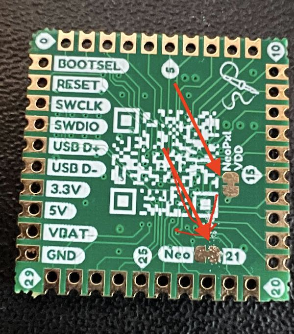

# Build Guide

## Part List
These parts are needed to create a complete keyboard. The "where to get it" column are just suggestions. There are many places to source most all of these parts.tt

| Count | Part | Description | Where to get it |
| --- | --- | --- | --- |
| 1  | PCB | The printed circuit board onto which will be mounted all of the components. | Here (pcb_stamp/production/gerber.zip) in this repository are the files necessary to have the board fabricated. I usec JLCPCB, and got excellent results for a good price. |
| 4 | Top Plate (1mm thickness) | The non-electrical plates that mechanically serve to hold the Choc switches in place. Two are required on each side. | Get these fabricated too. (top_plate/production/gerber.zip) |
| 1 | Bottom Plate | The non-electrical plate that serves as the base of the keyboard | Get these fabricated too. (bottom_plate/production/gerber.zip) |
| 42 | Choc sockets | Hotswappable Choc Sockets | [Adafruit Link](https://www.adafruit.com/product/5118)  |
| 42 | Choc switches | Pick your favorite switches | [Kailh](http://www.kailh.com/en/Products/Ks/CS/) |
| 42 | Choc compatible keycaps | Pick your favorite keycaps | [Little Keyboards Link](https://www.littlekeyboards.com/products/mbk-40s-keycaps) |
| 43 | Diodes | Vishay 1N4148W-E3-18 (Note there are **43** of these) | [Digi-Key Link](https://www.digikey.com/en/products/detail/vishay-general-semiconductor-diodes-division/1N4148W-E3-18/3104163) |
| 42 | Neopixel Reverse Mount RGB LEDs (SK6812-E) | Adafruit 4960 | [Adafruit Link](https://www.adafruit.com/product/4960) |
| 2 | 10K SMD Resistors | Stackpole RMCF0603JT10K0 | [Digi-Key Link](https://www.digikey.com/en/products/detail/stackpole-electronics-inc/RMCF0603JT10K0/1758104) |
| 2 | 5.1K SMD Resistors | Stackpole RMCF0603FT5K10 | [Digi-Key Link](https://www.digikey.com/en/products/detail/stackpole-electronics-inc/RMCF0603FT5K10/1760908) |
| 1 | RP2040 Stamp | RP2040 based MCU board | [Tindie Link](https://www.tindie.com/products/arturo182/rp2040-stamp/) |
| 1 | 128x64 OLED Display | | [Amazon Link](https://www.amazon.com/dp/B0B7RPCZ4Z?psc=1&ref=ppx_yo2ov_dt_b_product_details) |
| 1 | USB-C Connector | GCT USB4085-GF-A | [Digi-Key Link](https://www.digikey.com/en/products/detail/gct/USB4085-GF-A/9859662) |
| 2 | Push buttons | For reset and boot-select | [Adafruit Link](https://www.adafruit.com/product/1489) |
| 8 | M2*10 Screws | To hold the layers together | Assortment Kit at [Amazon](https://www.amazon.com/dp/B082XRX17Z?psc=1&ref=ppx_yo2ov_dt_b_product_details) |
| 8 | M2 Nuts | | See kit above |
| 16 | M2 Washers | | See kit above |
| 8 | Rubber Feet | | [Amazon Link](https://www.amazon.com/Adhesive-Drawers-Furniture-Dampening-Transparent/dp/B08NX9KXQP) |

## Steps

### 1. Soldering the LEDS, Diodes, and Resistors

I listed this as one step, because I use a reflow oven to solder them all at once. These parts are large enough, however to solder them by hand. Just use a narrow tipped soldering iron.

#### A. LEDS

I'm told that the Neopixel LEDS are liable to be damaged by excessive heat. So turn down your iron, and pause between pads to let the heat disipate. Also, these may just barely fit in the holes, so you may need to push them in a bit. Finally, place them with the LED side facing away from the component side. This is the "up" direction when the keyboard is complete. And orient the leads so that the one with the clipped corner is the GND lead. There are 42 LEDS

Todo: Picture of board w/ numbers on the LEDs

Because the LEDs all communicate serially, if there is a failure of one, it will take out all of the rest of them in the chain. See the picture for the order in which the LEDs are connected, 1 through 42.

Todo: Picture of LED w/ ground marked

If you have a failure, find the first LED that is not working. The problem is most likely in that LED, or the one just preceding it in the chain. Check carefully your soldering. You can check the continuity, for example, between DOUT of one LED and DIN of the next. Or you can check the VDD or GND connections. If you can't find the problem, then replace the suspicious LEDs.

#### B. Diodes

There are 43 diodes, one for each switch, and one additional to step down the power to the first LED so that it remains in spec even though the signal from the RP2040 is 3.3V. You don't need to know this, just solder the diodes in the orientation shown, with the two lines on the diode facing the same way as the diode symbol points.

Todo: Picture of a single diode

#### C. Resistors

There are 4 surface mount resistors, two near the USB-C connector, and two near the OLED display connections. Orientation does not matter. Just make sure you put the 5.1K resistor near the USB-C connector, and the 10K resistors near the OLED display.

### 2. The Sockets

The sockets not only require an electrical connection, but a good physical one too. This is because there is some force on the socket when inserting switches. Don't be afraid to use a good bit of solder, however, be cautious that the solder doesn't run inside the socked and foul the hotswappable springs that hold the switches.

Todo Picture closeup of sockets

### 3. The RP2040 Stamp

Use an Exacto knife to cut the LED jumpers to the Neopixel on the Stamp itself doesn't light up.

Carefully position the Stamp in the correct orientation, and lined up around all 4 sides. Tack down the daughter board with one or two castelated pads to the pad on the PCB. Once you have that done, it should be quick work to solder the rest of the pads all around.

Todo Picture closeup of stamp soldered in

### 4. The USB-C Connector (top side)

This can be hard to get right. The way I did it is to put a bit of solder paste on the pins of the socket, insert it into the holes, and then soldering the strain relief around the shield down. Then I heated each through-hole with the iron, and that seemed to work to attach the pins. I'm not too happy with this method, because I can't see how good of a job inside the holes, but it works. 🤷

Todo Picture closeup of USB-C

### 5. The Push Buttons (top side)

These are easy. Just stick them through the holes and solder.

Todo Picture closeup of Push Buttons 

### 6. The OLED Display (top side)

I removed the plastic spacer from the pins and just soldered it as flat as I could against the top of the PCB.

### 7. Testing

Before you screw the whole thing together, I would suggest some tests to see if it all works.

1. Connect the keyboard to a computer. It should come up, and mount as a flash drive in your OS. Download the `rvnash_richkbd_default.uf2` file from the [latest release](https://github.com/rvnash/qmk_firmware/releases) and drag it into that flash drive. The keyboard should restart, and connect itself as a keyboard. The LEDS should light up.
2. You can use a pair of tweezers to make contact accross a few sockets and test that some characters show on the screen.
3. You could put switches in every socket, and see that they all work.

### 8. Final assembly

If everything seems to work, just screw it all together with a washer on the top and bottom. From the bottom to the top, these are the layers to stack.

1. Bottom plate
2. PCB (fully soldered together)
3. 2 x Top plates per side (for a total of 4). These should be double stacked on each side.
4. The switches
5. The keycaps

Put a few rubber bumpers on the bottom so the screws aren't on the desk.

Good luck, have fun and reach out with any questions.